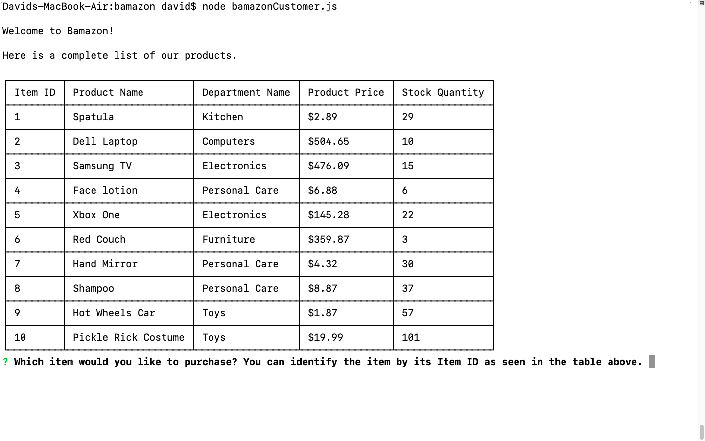
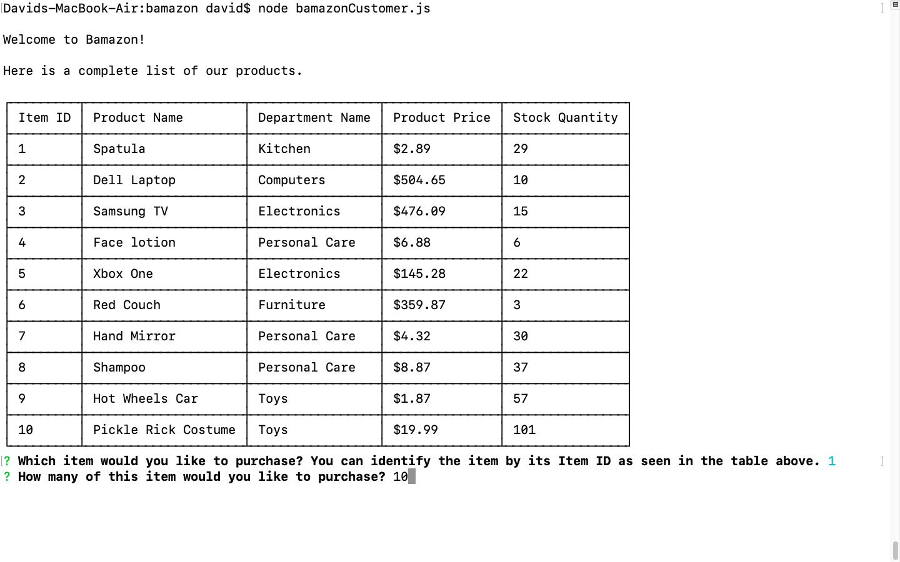
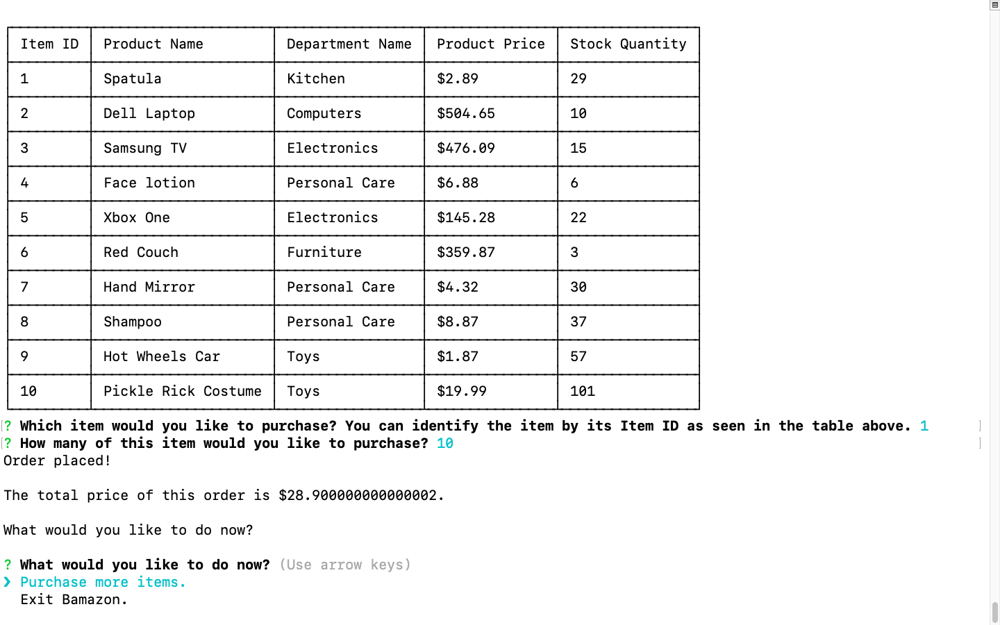
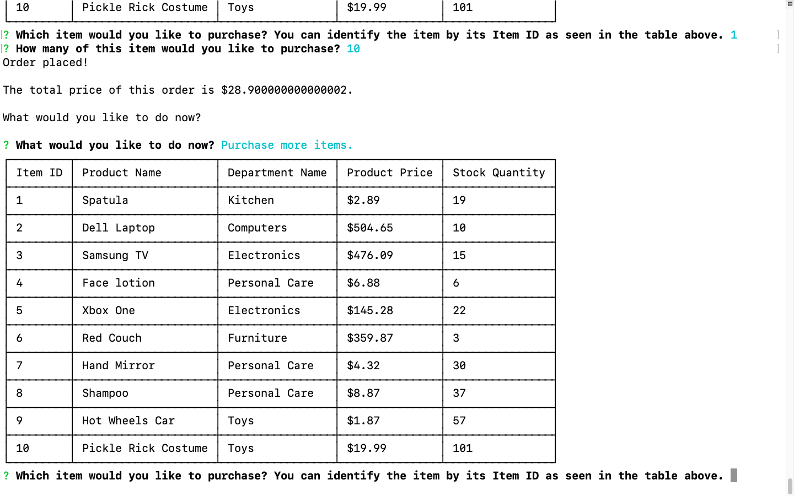
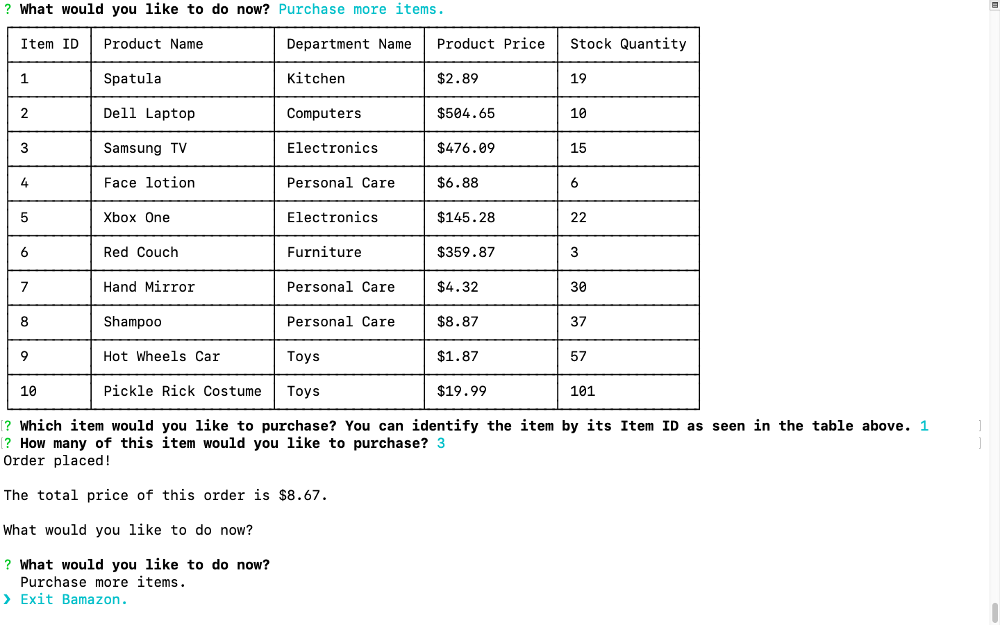
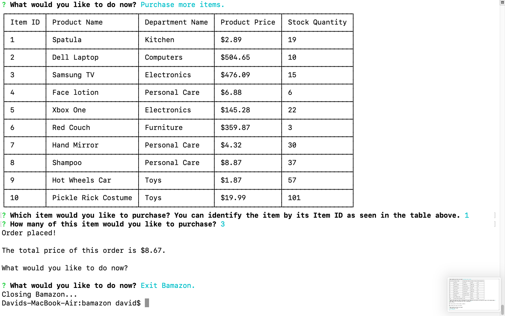

## Bamazon Application

Bamazon is a command line interface (CLI) application that allows users to purchase various products.

### How to Use Bamazon

1) Execute this command from a terminal session: 'node bamazonCustomer.js'.
2) Select a product to purchase from our available inventory.
3) Select a quantity of the item that you would like to purchase that is less than or equal to what we have available.
4) Your total cost will appear if your selection was valid.
5) Choose to make another purchase or exit Bamazon.

### Screenshots of Application

Starting the application.

Inserting data for the item ID and item quantity.

The total price of the order is displayed after the order has been placed.

The option 'Purchase more items.' has been selected by the user to purchase additional items.

The option to exit Bamazon is highlighted using the arrow keys on a keyboard.

The option to exit Bamazon has been exeucted.

###  Technologies Used

JavaScript, Node.js, and MySQL.